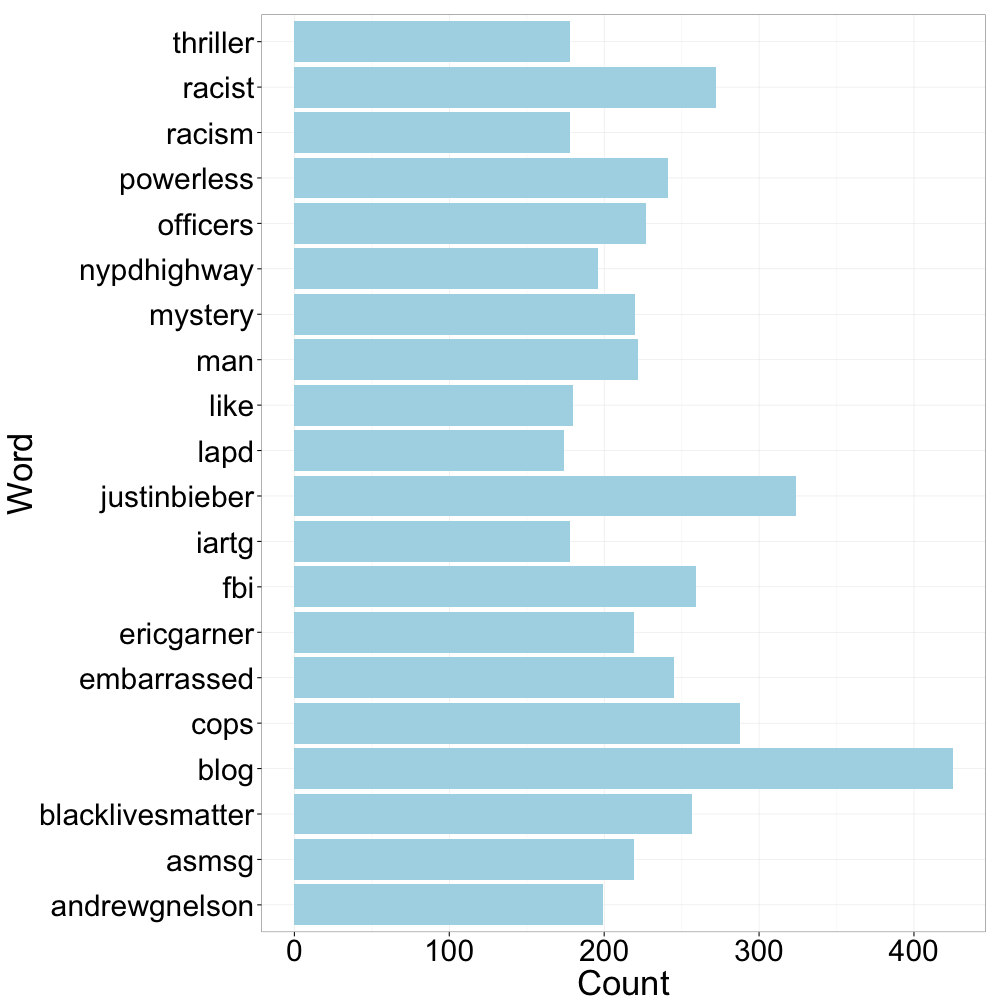

## Who am I?
- Graduated from Johns Hopkins University with a master's degree in Economics, focusing on statistics and econometrics. 
- Spent three years at a market research company learning computer programming and honing skills in data science.
- Currently work for the Manhattan District Attorney's Office in the Major Economic Crimes Bureau investigating money laundering and terrorist financing.

---
## What is R?
- Completely free, open-source software that was designed by statisticians for statisticians.
- Over 6,142 packages (aka plugins) on the R website.
- Growing quickly in both academic and non-academic industries.
- Currently being used by companies such as Google, Facebook, Firefox, Microsoft, and Twitter.

---
## Why Use R?


---
## Before We Get Started
- I'm going to be moving quick. This is not a tutorial on how to get started on R, but is instead an introduction to the program and what it can do for crime/intelligence analysis.
- It's going to be a bit overwhelming, especially since the syntax won't look like what you're used to. R syntax is different from SQL, Visual Basic, and definitely from Excel. Don't let it deter you.
- With that being said, I want to admit up front that while R is free, it comes with a cost. There is a fairly steep learning curve in the beginning, but overcoming it is quick.

--- .title-slide .mySegue
## Loading and Querying Data

--- .codefont2
## Loading Data into R
``` {r, eval=FALSE}
#Connect to an Access database:
library(RODBC)
con <- odbcConnect('path/to/your/access_database.db', uid='user_name', pwd='password')

#Connect to Excel database:
library(gdata)
dat <- read.xls('path/to/your/excel_database.xls', sheet=1, 
                na.strings=c('NA', '', '#DIV/0!'))

#Connect to a SQL database:
library(RSQLite)
con <- dbConnect(SQLite(), 'path/to/your/sql_database.db')

#Ideally, you'll be working with CSV and TXT files:
dat <- read.table('path/to/file.txt', header=T, sep='\t', stringsAsFactors=F)
#-or-
dat <- read.csv('path/to/file.csv', stringsAsFactors=F)
```

---  .codefont
## Querying Data - SQL
```{r, message=F}
library(RSQLite)
con <- dbConnect(SQLite(), dbname='Crimes.db')
dbGetQuery(con, 'SELECT * FROM Crime LIMIT 3')
```

--- .codefont
```{r}
dbListTables(con)
dbListFields(con, 'Crime')
dbGetQuery(con, 'SELECT ID, Date, Block FROM Crime 
           WHERE Block LIKE "% Av%" LIMIT 3')
```

--- .codefont
```{r}
dbExistsTable(con, 'Totals')
dbGetQuery(con, 'CREATE TABLE Totals AS SELECT DISTINCT 
           Date, count("Crime") as Total FROM Crime GROUP BY Date')
dbGetQuery(con, 'SELECT * FROM Totals LIMIT 5')
```

--- .codefont
```{r}
dbListTables(con)
dbRemoveTable(con, 'Totals')
dbListTables(con)
dbDisconnect(con)
```

--- .codefont
```{r}
con <- dbConnect(SQLite(), dbname='Investigations.db')
dbGetQuery(con, 'SELECT * FROM Cases')
```

Question: What is the easiest way to get all of the detectives working a case
on the same line?<br><br>
We'll revist this later.
```{r, echo=F}
invisible(dbDisconnect(con))
```

--- .codefont
## Querying Data - Base R
```{r}
dat <- read.csv('Chicago Crimes (subset).csv', stringsAsFactors=F)
head(dat, n=3)
```

--- .codefont
```{r}
head(dat[grepl('.*Av.*', dat$Block, ignore.case=T), c('ID', 'Date', 'Block')], n=5)
d.1 <- aggregate(list(Count=dat$Crime), list(Date=dat$Date), length)
head(d.1, n=5)
```

--- .codefont
```{r}
d.1 <- dat[dat$Arrest == 'true', ]
d.1[1:5, c('ID', 'Date', 'Arrest')]
d.1 <- dat[, c('Date', 'ID', 'Crime', 'Arrest')]
d.1[1:5, ]
```

--- .codefont
```{r}
head(dat$Description)
head(tolower(dat$Description))
t.1 <- gsub("\\b([A-Z])([A-Z]+)", "\\U\\1\\L\\2" ,dat$Description, perl=TRUE)
head(t.1)
```

--- .codefont
```{r}
unique(dat$Crime)[1:10]
x <- sample(dat$CaseNumber, 1000, replace=F)
y <- sample(dat$CaseNumber, 1000, replace=F)
x[which(x %in% y)]
```

--- .codefont
```{r}
grep('.*CRIMINAL.*', unique(dat$Crime), ignore.case=T, value=T)
dat$Crime[dat$Crime == 'NON-CRIMINAL (SUBJECT SPECIFIED)'] <- 'NON-CRIMINAL'
grep('.*CRIMINAL.*', unique(dat$Crime), ignore.case=T, value=T)
```

--- .codefont
```{r}
d.1 <- read.csv('Investigations.csv', stringsAsFactors=F)
d.1
```

We wanted to know the easiest way to rearrange the data so that each case was only one row. Not very easy to do in SQL, but let's see how we can do it in R.

--- .codefont3
```{r}
d.1$Index <- ave(rep(1, nrow(d.1)), d.1$Case, FUN=seq_along)
d.1
reshape(d.1, idvar='Case', timevar='Index', direction='wide')
```

--- .codefont
## Working With Data - dplyr

```{r, echo=F}
suppressMessages(library(dplyr))
```
```{r}
d.1 <- dat %>% filter(grepl('.*Av.*', Block, ignore.case=T)) %>% select(ID, Date, Block)
d.1[1:3, ]
d.1 <- dat %>% group_by(Date) %>% summarise(Count=n())
d.1[1:3, ]
```

--- .codefont
```{r}
dat$Street <- dat$Block %>% strsplit('\\d*XX ') %>% lapply(function(z) z[2]) %>% unlist()
head(dat$Street)
d.1 <- dat %>% group_by(Street) %>% summarise(NumCrimes=n()) %>% arrange(desc(NumCrimes))
head(d.1, n=5)
```

--- .codefont
```{r}
dat %>% group_by(Street, Crime) %>% summarise(Count=n()) %>% 
  mutate(maxCount=max(Count)) %>% 
  mutate(primaryCrime = ifelse(Count == maxCount, Crime, '')) %>% 
  arrange(desc(Count)) %>% group_by(Street) %>% filter(row_number(Street) == 1) %>% 
  select(Street, primaryCrime)
```

---
## Summary
- SQL has the upper hand when it comes to querying and manipulating databases with its 'sentence like' syntax that is easy to understand.
- R takes its own approach that can either mimic SQL with its operations or allow the user to simply use SQL.
- In addition, R has some unique functions, some of which are very powerful, such as regular expressions, that truly enhance the user's ability to query and manipulate.
- The dplyr package introduces a nice bridge between the power of R and the easy-to-understand language of SQL.
- The true advantage of R, as stated before, is that now that we have our data loaded and manipulated, we can start playing.

--- .title-slide. .mySegue
## Quantitative Analyses

--- .codefont
## Descriptive Statistics
R's primary purpose when it was created was to serve as a statistical analysis program, which means it's capable of calculating all of the values you're used to doing in Excel:
+ Mean
+ Median
+ Mode
+ Quantiles
+ Range
+ Variance
+ Standard Deviation
+ Correlations

--- .codefont
```{r}
dat <- read.csv('Chicago Crimes (subset).csv', stringsAsFactors=F)
d.1 <- dat %>% group_by(Beat, Year) %>% summarise(Count=n())
d.1
```

--- .codefont3
```{r}
d.1 %>% 
  group_by(Beat) %>% 
  summarise(Mean = mean(Count), Median=median(as.numeric(Count)), 
            Variance=var(Count), StDev=sd(Count))
summary(d.1$Count)
```

--- .codefont
```{r}
dat$Date <- as.Date(dat$Date, format='%m/%d/%Y %I:%M:%S %p')
dat %>% group_by(Beat, Date) %>% summarise(Count=n()) %>% 
  mutate(timeDiff=Date-lag(Date)) %>% 
  group_by(Beat) %>% 
  summarise(meanTimeDiff=mean(timeDiff, na.rm=T))
```

--- .codefont
```{r}
dat$Crime <- dat$Crime %>% tolower() %>% gsub(' ', '_', .)
crimes <- unique(dat$Crime)
dat[, crimes] <- 0
for (crime in crimes) dat[dat$Crime == crime, crime] <- 1
d.2 <- dat %>% group_by(Crime, Year) %>% summarise(Count=n())
d.2
```

--- .codefont
## Regressions
This is a placeholder slide for describing how to perform regression analyses

--- &twocol .codefont
## Plotting Data - Base R

*** =left
Types of graphs:
- <span style='color:#2F4F4F; font-weight:bold'>histogram</span>
- line graph
- scatterplot
- more examples

*** =right
```{r}
plotData <- table(dat$Crime)
plot(plotData, xlab='Crime', ylab='Count', main='Crime Counts in Chicago')
```

--- &twocol .codefont
## Plotting Data - Base R

*** =left
Types of graphs:
- histogram
- <span style='color:#2F4F4F; font-weight:bold'>line graph</span>
- scatterplot
- more examples

*** =right
```{r}
plotData <- dat %>% group_by(Year) %>% summarise(Count = n()) %>% filter(Year < 2015)
plot(plotData$Year, plotData$Count, type='l', xlab='Year', ylab='Count', main='Crimes by Year in Chicago')
```

--- &twocol .codefont
## Plotting Data - Base R

*** =left
Types of graphs:
- histogram
- line graph
- <span style='color:#2F4F4F; font-weight:bold'>scatterplot</span>
- more examples

*** =right
```{r}
plotData <- dat %>% group_by(Crime, Year) %>% summarise(Count = n()) %>% filter(Crime %in% c('assault', 'battery'))
x <- plotData$Count[plotData$Crime == 'assault']
y <- plotData$Count[plotData$Crime == 'battery']
plot(x, y, type='p', xlab='Assault', ylab='Battery')
```

--- &twocol .codefont .dontCount
## Plotting Data - Base R

*** =left
Types of graphs:
- histogram
- line graph
- <span style='color:#2F4F4F; font-weight:bold'>scatterplot</span>
- more examples

*** =right
```{r}
plot(x, y, type='p', xlab='Assault', ylab='Battery')
abline(lm(y ~ x), col='red')
```

--- &twocol .codefont
## Plotting Data - Base R

*** =left
Types of graphs:
- histogram
- line graph
- scatterplot
- <span style='color:#2F4F4F; font-weight:bold'>more examples</span>

*** =right


--- .codefont
## Plotting Data - ggplot2
```{r, echo=F, message=F}
suppressPackageStartupMessages(library(ggplot2))
suppressPackageStartupMessages(library(ggthemes))
```
Same types of graphs, just much, much more control over the elements
```{r, eval=F}
library(ggplot2)
library(ggthemes)
```

--- .codefont
## Plotting Data - googleVis
```{r, echo=F, message=F}
suppressPackageStartupMessages(library(googleVis))
suppressPackageStartupMessages(library(rCharts))
```
```{r, eval=F}
library(googleVis)
library(rCharts)
```
googleVis allows for interactive graphs that show changes over time. Good for looking at total number of crimes by beat each year to see changes. 

--- .codefont
## GIS/Spatial Analysis
```{r, echo=F, message=F}
suppressPackageStartupMessages(library(rMaps))
suppressPackageStartupMessages(library(ggmap))
```
```{r, eval=F}
library(rMaps)
library(ggmap)
```
Placeholder for:
- Chloropleth maps
- Heat maps
- Graduated symbol maps

--- .title-slide .mySegue
## Qualitative Analyses

--- .codefont
## Mining Twitter
```{r, echo=F, results='hide', message=F}
suppressPackageStartupMessages(library(httr))
library(twitteR)
source('~/R/Syntax/twitterKeys.R')
setup_twitter_oauth(consumerKey, consumerSecret, oauthKey, oauthSecret)
```
```{r, eval=F}
library(twitteR)
searchTwitter(' ', n=5, geocode='39.7392,-104.9903,0.5mi')
```
```{r, echo=F}
t.1 <- searchTwitter(' ', n=5, geocode='39.7392,-104.9903,0.5mi')
sapply(t.1, function(z) paste0(z$screenName,": ", z$text))
```
```{r, eval=F}
searchTwitter('crime', n=5, geocode='40.7127,-74.0059,5mi')
```
```{r, echo=F}
t.1 <- searchTwitter('crime', n=5, geocode='40.7127,-74.0059,5mi')
sapply(t.1, function(z) paste0(z$screenName, ': ', z$text))
```

--- &twocol .codefont2
*** =left
```{r, echo=F, message=F}
suppressPackageStartupMessages(library(tm))
suppressPackageStartupMessages(library(SnowballC))
t.1 <- searchTwitter('#nypd', n=5000)
tweets <- twListToDF(t.1)
tweetText <- iconv(tweets$text, to='ASCII', sub='')
myCorpus <- VCorpus(VectorSource(tweetText))
myCorpus <- myCorpus %>% 
  tm_map(content_transformer(tolower), lazy=T) %>% 
  tm_map(removePunctuation, lazy=T) %>% 
  tm_map(removeNumbers, lazy=T) %>% 
  tm_map(removeWords, stopwords('english'), lazy=T)
tdm <- TermDocumentMatrix(myCorpus)
term.freq <- rowSums(as.matrix(tdm)) %>% subset(., .>=15)
d.1 <- data.frame('Word'=names(term.freq), 'Count'=term.freq)
d.1 <- d.1 %>% arrange(desc(Count)) %>% filter(!Word %in% stopwords('en')) %>% 
  filter(!Word %in% c('new', 'york', 'newyork', 'manhattan', 'nyc', 'nypd',
                      'httptcoocplgbwdqs', 'http', 'htt', 'httptco', 
                      'officer', 'police', 'nypdpct', 'girl', 'amp', 'cop')) %>% 
  filter(row_number() <= 20)
```
```{r, eval=F}
library(tm)
t.1 <- searchTwitter('#nypd', n=5000)
tweets <- twListToDF(t.1)
tweetTxt <- iconv(tweets$text, 
                   to='ASCII', sub='')
myCorpus <- Corpus(VectorSource(tweetText))
myCorpus <- myCorpus %>%
  tm_map(tolower) %>%
  tm_map(removePunctuation) %>%
  tm_map(removeNumbers) %>%
  tm_map(removeWords, 
         stopwords('english'))
tdm <- TermDocumentMatrix(myCorpus)
term.freq <- rowSums(as.matrix(tdm))
d.1 <- data.frame('Word'=names(term.freq), 
                  'count'=term.freq)
d.1 <- d.1 %>% arrange(desc(Count)) %>%
  filter(!Word %in% myStopWords, 
         row_number() <= 20)
```

*** =right
```{r, echo=F, results='hide'}
p <- ggplot(d.1, aes(x=Word, y=Count)) + 
  geom_bar(stat='identity', fill='light blue') + theme_bw() + coord_flip() +
  theme(axis.title.x=element_text(size=rel(2.9), vjust=-0.3), 
        axis.title.y=element_text(size=rel(2.9), vjust=1), 
        axis.text=element_text(size=rel(2.5)))
png('TextMine.png', width=1000, height=1000)
p
invisible(dev.off())
```


---  .codefont
```{r}
user <- getUser('hadleywickham')
user$location
user$lastStatus$text
friends <- user$getFriends() %>% 
  lapply(function(z) z$screenName) %>% unlist() %>% unname()
head(friends)
```

--- &twocol .codefont2
## Link Analyses

*** =left
```{r, eval=F}
library(igraph)
userList <- lookupUsers(friends)
realNames <- c('Hadley Wickham', 
               sapply(userList, 
                      function(z) z$name) 
               %>% unname())
adj.mat <- length(realNames) %>% 
  matrix(0, nrow=., ncol=.)
colnames(adj.mat) <- rownames(adj.mat) <- realNames
adj.mat[1, -1] <- 1
idx <- 1
for (friend in friends) {
  theirFriends <- userList[[friend]]$getFriends() %>% 
    lapply(function(z) z$name) %>% 
    unlist() %>% unname()
  row.idx <- which(rownames(adj.mat) == userList[[friend]]$name)
  col.idx <- which(colnames(adj.mat) %in% theirFriends)
  if (!length(col.idx) == 0) adj.mat[row.idx, col.idx] <- 1
  fileName <- paste(c('twitterPics/', userList[[friend]]$name, '.', 
                    file_ext(userList[[friend]]$profileImageUrl)),
                    collapse='')
  download.file(userList[[friend]]$profileImageUrl, destfile=fileName)
  idx <- idx + 1
  if (idx %% 15 == 0) Sys.sleep(900)
}

twitter.net <- graph.adjacency(adj.mat, diag=F, mode='undirected')
l <- layout.fruchterman.reingold(twitter.net, niter=10000, area=vcount(twitter.net)^2.3,
                                  repulserad=vcount(twitter.net)^2.2)
l <- layout.norm(l, -1, 1, -1, 1)
 
png("Twitter Graph.png", width = 2500, height = 2000)
plot(twitter.net, vertex.size=degree(twitter.net)/20, vertex.label=NA,
     vertex.color='white', vertex.shape="square", vertex.frame.color="white", 
     edge.color='dark gray', edge.width=1, edge.arrow.size=0, edge.curved=0.3,  layout=l)
img.sc <- 0.03 #Image scaling
images <- c('twitterPics/Hadley Wickham.jpeg', sample(list.files('twitterPics', full.names=T), 223, replace=T))
for (i in 1:dim(l)[1]) {
  img <- images[i]
  if (grepl("jp[e]?g", img)) {
    img <- readJPEG(img)
  } else if (grepl('png', img)) {
    img <- readPNG(img)
  } else {
    img <- 'gray20'
  }
  rasterImage(img, l[i,1]-img.sc, l[i,2]-img.sc, l[i,1]+img.sc, l[i,2]+img.sc)
}
dev.off()
```

*** =right

[View in new window](Twitter Graph.png)

--- &twocol .codefont2
## Reading the News (Advanced Topic)

*** =left
<q>"The simplest way to conduct a periodical literature review is to employ <br>commercially available software that allows a keyword or phrase search."</q><cite> - Noah Fritz et al, Exploring Crime Analysis</cite>
<p class="center"><em class="style2">I strongly disagree!</em></p><br>


*** =right
```{r, eval=F}
#! usr/bin/env RScript

library(RCurl)
library(XML)
suppressMessages(library(dplyr))

#File Administration
file.remove(dir('~/Documents/Daily News/', full.names=T))

logFile <- paste0('~/Documents/Web Crawler Log - ', Sys.time(), '.txt')
file.create(logFile)

newsFileText <- paste0('~/Documents/Daily News/IMMC Monitor - ', Sys.time(), ' (Text).txt')
file.create(newsFileText)

newsFileHTML <- paste0('~/Documents/Daily News/IMMC Monitor - ', Sys.time(), ' (HTML).txt')
file.create(newsFileHTML)
paste('<html><head></head><body>') %>% write(., file=newsFileHTML)

#Define functions
link.format <- function(link, root) {
  if (!grepl('http[s]?://', link)) link <- paste0(root, link)
  return(link)
}

link.fetch <- function(link, xpaths, root) {
  html <- getURL(link) %>% htmlParse()
  t.1 <- sapply(xpaths, function(z) xpathSApply(html, z, xmlGetAttr, 'href')) %>% 
    unlist() %>% unname()
  t.1 <- sapply(t.1, function(z) link.format(z, root)) %>% unname()
  write(txt, file=logFile, append=T)
  return(t.1)
}

spider <- function() {
  #Reuters
  root = 'http://www.reuters.com'
  navbar.links <- link.fetch('http://www.reuters.com',
                             '//div[@id="nav-strip"]//li[contains(@id, "nav-item_")]/a',
                             root)
  navbar.links <- navbar.links[2:6]

  xpath <- '//div[@class="sectionContent"]//div[contains(@class, "column1")]//a'
  reuters.links <- sapply(navbar.links, function(z) link.fetch(z, xpath, root)) %>% 
    unlist() %>% unname()
  reuters.links <- reuters.links[grepl('.*/article/.*', reuters.links)]

  #The BBC
  root = 'http://m.bbc.com'
  navbar.links <- link.fetch('http://m.bbc.com/news',
                             '//div[@class="navigation navigation--wide"]//a',
                             root)
  navbar.links <- navbar.links[grepl('world|uk|business|technology', navbar.links)]

  xpaths <- c('//div[@class="column--primary"]/div[@id="comp-candy-asset-munger" and contains(@class, "buzzard")]//a',
              '//div[@class="column--primary"]/div[@id="comp-candy-asset-munger" and contains(@class, "pigeon")]//a',
              '//div[@class="column--primary"]/div[@id="comp-candy-asset-munger" and contains(@class, "macaw")]//a')

  bbc.links <- sapply(navbar.links, function(z) link.fetch(z, xpaths, root)) %>% 
    unlist() %>% unname()
  bbc.links <- bbc.links[grepl('.*\\d$', bbc.links)]
  bbc.links <- bbc.links[!grepl('.*/sport/.*|.*/entertainment.*|.*/live/.*|.*/science.*|.*/health.*|.*/newsbeat/.*', bbc.links)]

  #Al Jazeera
  root = 'http://america.aljazeera.com'
  navbar.links <- link.fetch('http://america.aljazeera.com',
                             '//div[contains(@class, "header-sections-items")]/a',
                             root)
  navbar.links <- navbar.links[1:4]

  xpath <- '//div[@class="media-body"]//h3/a'
  aljazeera.links <- sapply(navbar.links, function(z) link.fetch(z, xpath, root)) %>% 
    unlist() %>% unname()
  aljazeera.links <- aljazeera.links[grepl('.*/articles/.*', aljazeera.links)]


  article.links <- c(reuters.links, bbc.links, aljazeera.links, cnn.links)
  bad.words <- paste(c('.*/opinions/.*', '.*/living/.*', '.*/interactive/.*',
                       '.*/travel/.*', '.*health.*'), collapse='|')
  article.links <- article.links[!grepl(bad.words, article.links)]
  return(article.links)
}

check.article <- function(article, keywords) {
  txt <- getURL(article) %>% htmlParse() %>% xpathSApply(., '//p', xmlValue)
  t.1 <- grepl(keywords, txt, ignore.case=T) %>% unname()
  if (sum(t.1) >= 3) return(TRUE)
  else return(FALSE)
}

sifter <- function(links, keywords) {
  keep <- sapply(links, function(z) check.article(z, keywords))
  l.s <- links[keep]
  return(links[keep])
}

parse.article <- function(article) {
  txt <- getURL(article) %>% htmlParse()
  title <- xpathSApply(txt, '//h1', xmlValue)
  title <- ifelse(length(title) > 1, title[1], title)
  src <- strsplit(article, 'http[s]?://www.|http[s]?://money.|http[s]?://m.|http[s]?://america.', fixed=F)[[1]][2]
  src <- strsplit(src, '.com', fixed=T)[[1]][1] %>% toupper()
  if (src == 'BBC') {
    smry <- xpathSApply(txt, '//div[@class="story-body"]//p', xmlValue)[1]
  } else if (src == 'REUTERS') {
    src <- 'Reuters'
    par <- xpathSApply(txt, '//p', xmlValue)
    idx <- grep('.*\\(Reuters\\)', par, value=F)
    smry <- par[idx] %>% strsplit(., '.*\\(Reuters\\)( - )?') %>% unlist() %>% .[2]
  } else if (src == 'ALJAZEERA') {
    src = 'Al Jazeera'
    smry = xpathSApply(txt, '//p', xmlValue)[2]
  }
  v = list('Title' = title, 'Source' = src, 'Summary' = smry, 'Link' = article)
  return(v)
}

write.to.txt <- function(element) {
  x <- paste(c(element$Title, ' - (', element$Source, ')\n\n', element$Summary,
               ' Read more: ', element$Article, '\n\n'), collapse='')
  write(x, file=newsFileText, append=T)
}

write.to.html <- function(element) {
  x <- paste(c('<h4 style="margin-bottom:1px">', element$Title, ' - (', element$Source, ')</h4><p>',
               element$Summary, '<br><a href="', element$Link, '">Full Story</a></p>'),
             collapse = '')
  write(x, file=newsFileHTML, append=T)
}

msg.prep <- function(articles) {
  v <- lapply(articles, function(z) parse.article(z))
  lapply(v, function(z) {
    write.to.txt(z)
    write.to.html(z)
    })
  write('</body></html>', file=newsFileHTML, append=T)
}

#Run crawler and send the email
x <- spider()
x <- x[!duplicated(x)]

keywords <- c('laundering', 'Ira[nq]', 'Russia', 'Islam', 'Kurd', 'Ukraine',
              'Cyprus', 'fraud', 'theft', 'forgery', 'bsa',
              'sanction[s]?', 'narcotic[s]?', 'traffick(ing)?', 'hack(er)?(ing)?')
keywords <- paste(keywords, collapse='|')
articles <- sifter(x, keywords)

msg.prep(articles)

system('python ~/Python/Syntax/sendMail.py')

print('Email sent. Please check your inbox.')
rm(list=ls())
```

--- .codefont3
## Parsing PDFs (Advanced Topic)

[Original PDF](Sample Report Redacted.pdf)<br>
```{r, eval=F}
library(magrittr)
library(XML)
suppressMessages(library(dplyr))

report.to.data <- function(file) {
  txt <- readLines(con=file)
  txt <- gsub('?[[:space:]]?', '', txt)
  
  #Block off data for each "report"
  headers<- grep('[0-9]{10,13},[0-9]{13},', txt, value=T)
  h.1 <- which(txt %in% headers)
  h.2 <- h.1 - 1
  h.2 <- c(h.2[-1], length(txt))
  
  txt.l <- vector('list', length(headers))
  
  for (i in 1:length(txt.l)) {
    s <- h.1[i]
    f <- h.2[i]
    txt.l[[i]] <- txt[s:f]
  }
  
  #Format annotation text
  a.1 <- lapply(txt.l, function(z) if (grepl('\\"text/css\\">', z[1])) paste(z[10:length(z)], collapse=' ') 
                else paste(z, collapse=' '))
  a.2 <- lapply(a.1, function(z) if (grepl('^[0-9]', z)) unlist(z) %>% strsplit(',') %>% .[[1]] %>% tail(., -22)
                else z)
  a.3 <- lapply(a.2, function(z) unlist(z) %>% strsplit(',|>') %>% 
                  unlist() %>% grep('^[[:space:]]|^[A-Za-z]', ., value=T))
  a.4 <- lapply(a.3, function(z) unlist(z) %>% strsplit('</?.*$') %>% unlist() %>% paste(collapse=' '))
  
  #Generate dataset
  r.1 <- lapply(txt.l, function(z) z[1] %>% strsplit(',') %>% unlist() %>% .[c(1, 3, 4, 5, 7:10)])
  dat <- unlist(r.1) %>% matrix(nrow=length(r.1), byrow=T) %>% data.frame(stringsAsFactors=F)
  names(dat) <- c('PrimaryNumber', 'TargetProdID', 'StartTime', 'EndTime',
                  'SecondaryNumber', 'Originator', 'Var1', 'Var2')
  dat$Annotation <- a.4 %>% lapply(., function(z) gsub('\\s+', ' ', z)) %>% 
                  lapply(., function(z) gsub('^\\s|\\s$', '', z))                
  
  #Format dataset
  dat <- dat[!duplicated(dat), ]
  dat$StartTime <- dat$StartTime %>% as.POSIXct(format='%m-%d-%Y %H:%M:%S')
  dat$EndTime <- dat$EndTime %>% as.POSIXct(format='%m-%d-%Y %H:%M:%S')
  dat$StartTime <- dat$StartTime - 14400
  dat$EndTime <- dat$EndTime - 14400
  
  #Combine records with same TargetProdID
  d.1 <- dat %>% group_by(PrimaryNumber, TargetProdID) %>% summarise(Annotation=paste(Annotation, collapse=' '))
  dat <- dat %>% group_by(PrimaryNumber, TargetProdID) %>% filter(row_number() == 1) %>% 
            select(PrimaryNumber:SecondaryNumber) %>% inner_join(., d.1) %>% arrange(PrimaryNumber, TargetProdID)
  return(dat)
}
```
```{r, echo=F}
dat <- read.csv('Redacted Annotation Report.csv', stringsAsFactors=F)
dat$Date <- substr(dat$StartTime, 1, 10)
dat$StartTime <- substr(dat$StartTime, 12, 19)
dat$EndTime <- substr(dat$EndTime, 12, 19)
dat <- dat[, c('PrimaryNumber', 'SecondaryNumber', 'Date', 'StartTime', 'EndTime', 'Annotation')]
dat[1:5, ]
```

---
## Final Thoughts

- R is an extremely powerful language, but it's also complicated.
- There are a ton of resources out there that can help you problem solve any issues you may be having, provided you know the tricks. 
- Some of the more useful resources:
  + R Documentation (?[function])
  + Stack Overflow (www.stackoverflow.com)
  + The R Analyst (www.theRanalyst.com)
  + RStudio Cheatsheets (http://www.rstudio.com/resources/cheatsheets/)
  + Coursera (www.coursera.org/course/compdata)

---
## Questions?


---
## Contact Information

Office: (212) 335-4309<br>
Professionial: brittenb@dany.nyc.gov<br><br>
Cell: (517) 410-3184<br>
Personal: britten.bryan@gmail.com<br>
